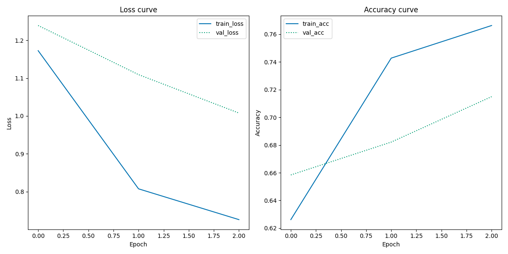

[](https://classroom.github.com/a/Aj7Sf-j_)
[](https://classroom.github.com/online_ide?assignment_repo_id=10866179&assignment_repo_type=AssignmentRepo)
# Using pretrained CNNs for image classification

This repo contains code which trains a pretrained CNN on a dataset on images of *Indo fashion* taken from a [Kaggle dataset](https://www.kaggle.com/datasets/validmodel/indo-fashion-dataset) by Rashmi Margani. The dataset has a accompanying paper on *arXiv.org* which can be read [here](https://arxiv.org/abs/2104.02830).

The code in this repository does the following:

- Trains a classifier on the *Indo fashion* dataset using the *pretrained CNN* called *VGG16*
- Saves training and validation history plots
- Saves a classification report

## User instructions

1. The user needs to download the dataset and have the folder open on the same level as this repository.
The dataset can be downloaded from Kaggle [here](https://www.kaggle.com/datasets/validmodel/indo-fashion-dataset).

**NB** The code includes absolute paths which means that the code may not be able to run if the the paths to the images do not match up with the ones defined in the code (example: /work/images/test/0.jpeg). The user may therefore change this section of the code if necessary. 

2. Run the ```setup.sh``` file to install necessary packages to run the code in this repository:

```bash setup.sh```

3. Run the ```run.sh``` file from command line to run the code:

```bash run.sh```

This installs the necessary packages into a virtual enviroment and runs the code which trains the classifier, saves the training and validation history plots as well as the classification report.

## Repository structure

| Item | Description |
| --- | --- |
| data | folder in which the user may save the dataset |
| out | folder where the history plots and classification report will be saved to |
| src | folder which contains the .py script |
| requirements.txt | text file listing the necessary packages to run the code |
| run.sh | shell file which runs the code in src |
| setup.sh | shell file which installs the necessary packages |

## Discussion

The goal of this repository is to train a pretrained classifier on a unseen dataset which is a concept known as *transfer learning*. Pretrained classifiers like VGG16 are effective because they have been trained on very large amounts of data which requires a vast amount of ressources. A pretrained classifier therefore makes classification tasks more efficient and available to the average user.

First I attempted to train the classifier with 10 epochs. But after four hours of training on a 32 CPU machine, the code had only run through approximately 1 1/3 epoch. I had expected that the process would go significantly faster after the first epoch but that did not seem to be the case. I assessed that training 10 epochs would not be feasible and therefore decided to cut down the amount of data and epochs. 
I used pandas to get an equally distributed sampling from each class, thereby reducing the size of the dataset by 50%. Additionally I reduced the amount of epochs from 10 to 3. This then took about 3 hours to train on a 32 CPU machine.

                      precision    recall  f1-score   support

    blouse                  0.96      0.09      0.17       250
    dhoti_pants             0.83      0.54      0.65       250
    dupattas                0.65      0.59      0.62       250
    gowns                   0.67      0.45      0.54       250
    kurta_men               0.64      0.90      0.75       250
    leggings_and_salwars    0.61      0.78      0.69       250
    lehenga                 0.86      0.88      0.87       250
    mojaris_men             0.83      0.86      0.85       250
    mojaris_women           0.86      0.82      0.84       250
    nehru_jackets           0.78      0.84      0.81       250
    palazzos                0.88      0.72      0.79       250
    petticoats              0.81      0.79      0.80       250
    saree                   0.62      0.93      0.75       250
    sherwanis               0.88      0.66      0.76       250
    women_kurta             0.45      0.84      0.59       250

    accuracy                                    0.71      3750
    macro avg               0.76      0.71      0.70      3750
    weighted avg            0.76      0.71      0.70      3750

Overall, the f1-scores does seem balanced with an avg f1-score of 0.71. There is an exception with the class "blouse", however. Here the precision is very high which means that the vast majority of blouses that where predicted as blouses were actually blouses. However, the recall score is extremely low which means that there is a huge procent of blouses that was not indentified as blouses but as something else. With the women's kurta the problem is the opposite (although not as severe). Here the low precision score means that there were many examples where something was labeled as a women's kurta but it actually wasn't. The higher recall means that the majority of women's kurtas was labeled as such. 

Since the support (number of class occurences) is equal for every category, this is not due an inbalance in the data, but perhaps a need to train on a larger fraction of the dataset for longer epochs. Alternatively, the low recall score for the blouse category could mean that there is a large dissimilarity between the images. In that case the model struggles to find a pattern that fits the majority of the images as opposed to only a fraction. Perhaps if some blouses are seen in full body view while others are seen from the waist up. This would require a closer inspection of the data set.




The loss curve of a well performing model would start off high but eventually flatten out where the training and the validation curve would ideally move closer together. The loss curves above does not really flatten out and the two curves do not grow closer. The model does not seem overfitted because the training loss curve gets continually lower and not the opposite. Neither the loss- or the accuracy curve seem to fully reach a plateau which could mean that the model could benefit from training for more epochs. 